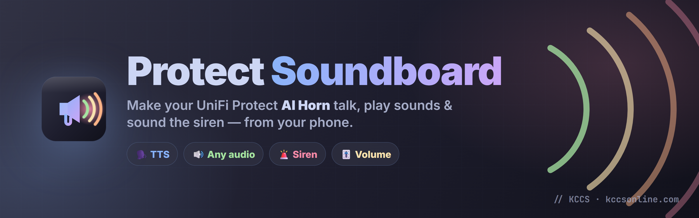

<div align="center">



```
   ___          _            _     ____                       _ _                      _
  | _ \_ _ ___ | |_ ___  __ | |_  / ___| ___  _   _ _ __   __| | |__   ___   __ _ _ __| |
  |  _/ '_/ _ \|  _/ -_)/ _||  _| \___ \/ _ \| | | | '_ \ / _` | '_ \ / _ \ / _` | '__| |
  |_| |_| \___/ \__\___|\__| \__| |____/\___/ \__,_|_| |_|\__,_|_.__/ \___/ \__,_|_|  |_|
                                                                                          
        📣  Talk, play sounds, and trigger the siren on a UniFi Protect AI Horn  📢
```

# Protect Soundboard

**Tap-to-play messages, sound effects, and siren control for the UniFi Protect AI Horn Speaker + PoE Siren.**

A small, self-hosted, mobile-first PWA. Type any text and your AI Horn *speaks it* in a premium voice.
Tap a preset to bark "get off my lawn." Slam the siren. All from your phone.

[](LICENSE)


<sub>An open tool by <b><a href="https://kccsonline.com">KCCS</a></b> · © 2026 · kccsonline.com</sub>

</div>

---

## 📸 Screenshots

<div align="center">

| Mobile | Desktop |
|:---:|:---:|
|  |  |

</div>

---

## ✨ What it does

| Feature | Description |
|---------|-------------|
| 🗣️ **Say something** | Type any text → the AI Horn speaks it aloud, live, in Protect's **clean native voice**. |
| 💬 **Message presets** | One-tap spoken messages — *Get Off My Lawn*, *Intruder Alert*, *You're Being Recorded*, *No Soliciting*… (fully editable in-app). |
| 🔊 **Sound effects** | Drop any `.mp3`/`.wav` into `sounds/` and it appears as a button. Air horn, alarm beep, dog bark, whatever. *(streamed via talkback — see the firmware note below)* |
| 🚨 **Siren** | Trigger the PoE siren for 5 / 10 / 30 / 60 s, or stop it instantly. |
| 🎚️ **Volume** | Live sliders for horn + siren, clamped to a safety cap (default 60%), with an **Allow loud** override. |
| 🟢 **Live status** | Connection LEDs + current volume for both devices, refreshed every 8 s. |
| 📱 **Installable PWA** | Add to home screen; runs full-screen like a native app. |

---

## 🧠 How it works (the interesting part)

There are **three** distinct control paths, and which one fires depends on what you're doing:

```
   ┌─────────────────────────────────────────────────────────────────────────┐
   │                          Protect Soundboard (Flask)                      │
   └─────────────────────────────────────────────────────────────────────────┘
        │                          │                              │
        │ spoken text (DEFAULT)    │ sound-effect FILES           │ siren + volume
        │ clean native voice       │ (talkback, best-effort)      │
        ▼                          ▼                              ▼
  ╔══════════════════════╗   ╔══════════════════╗     ╔═══════════════════════╗
  ║  POST /automations/  ║   ║  TALKBACK (WS)   ║     ║  PATCH /sirens/{id}    ║
  ║       run            ║   ║  stream AAC-LC   ║     ║  PATCH /speakers/{id}  ║
  ║  PLAY_TEXT_ON_SPEAKER ║   ║  frames to horn  ║     ║  (direct private API)  ║
  ╚══════════════════════╝   ╚══════════════════╝     ╚═══════════════════════╝
        │                          │                              │
        ▼                          ▼                              ▼
   AI Horn SPEAKS            AI Horn plays a file        Siren sounds /
   (clean, reliable)        (may garble, see note)       volume changes
```

1. **Native Protect TTS — the clean, default path for speech.** `POST /proxy/protect/api/automations/run`
   with a `PLAY_TEXT_ON_SPEAKER` action runs the console's *Test Alarm* dry-run: the horn speaks your text
   live, in Protect's built-in voice. It's robotic, but it's **reliable and never garbles**. Every "Say
   something" and message-preset button uses this. No owner account, no 2FA.
2. **Talkback WebSocket stream — for arbitrary audio files.** Open `wss://<nvr>/proxy/protect/ws/talkback?speaker=<id>`
   and push **frame-aligned AAC-LC ADTS** (24 kHz mono) as binary WS frames, paced ~42.7 ms each; the NVR relays
   each to the speaker as UDP. This is the **only** way to play an arbitrary audio *file* on the horn — but see
   the firmware note. (It can also stream premium-TTS MP3 bytes; that's opt-in via `tts_mode`.)
3. **Direct private-API PATCH** — siren on/off (`sirenStatus`) and volume are simple authenticated `PATCH`
   calls against `/sirens/{id}` and `/speakers/{id}`.

> ⚠️ **Firmware note (Protect 7.1.x): talkback streaming can garble.** On current Protect firmware the talkback
> audio path is intermittently choppy/garbled, and it's **host-independent** (reproduced from a clean, idle
> host). So this app **defaults to native TTS** (`tts_mode: "unifi"`) for all speech, which is clean. Talkback
> is used only for sound-effect files, where it's best-effort. Premium ElevenLabs TTS (streamed via talkback)
> is **opt-in** (`tts_mode: "elevenlabs_then_unifi"`) precisely because it inherits this garble. See the doc
> below for two promising leads on a garble-free file path (the horn's native Opus talkback format + its
> on-device audio-clip list).

> 📖 **Full technical write-up with copy-paste code:** [`docs/CONTROLLING-UNIFI-PROTECT-AUDIO.md`](docs/CONTROLLING-UNIFI-PROTECT-AUDIO.md)
> — authenticate, discover device IDs, speak clean TTS, stream audio, trigger the siren, set volume.

---

## 🚀 Quick start

```bash
git clone https://github.com/pueblokc/protect-soundboard
cd protect-soundboard

cp .env.example .env          # fill in your NVR host + a Protect local admin
pip install -r requirements.txt
#  ↑ also requires ffmpeg on PATH  (winget install ffmpeg | brew install ffmpeg | apt install ffmpeg)

python app.py                 # → http://127.0.0.1:5123
```

Then open `http://127.0.0.1:5123` on your phone or desktop. Done.

### Configure your devices

Edit `config.json` and replace the placeholders with **your** speaker/siren IDs. To find them, hit your NVR's
bootstrap endpoint once:

```bash
# Log in, grab the device IDs from the speakers[] and sirens[] arrays:
curl -sk https://<NVR>/proxy/protect/api/bootstrap -b cookies.txt | python -m json.tool | grep -A3 '"speakers"\|"sirens"'
```

(The doc above walks through this step in detail.)

| Key | What it is |
|-----|-----------|
| `host` | Your NVR / console IP or hostname |
| `devices.horn_id` | The speaker's `id` from `bootstrap.speakers[]` |
| `devices.horn_mac` | That speaker's `mac` (used by the built-in-TTS fallback) |
| `devices.siren_id` | The siren's `id` from `bootstrap.sirens[]` |
| `max_volume` | Safety cap (0–100). The UI's "Allow loud" toggle overrides it per-press. |
| `tts_mode` | **`unifi`** (default — clean native voice, recommended) · `elevenlabs_then_unifi` (premium ElevenLabs via talkback, **may garble**, falls back to native) · `elevenlabs` (premium only) |

---

## 🧩 Requirements

- **Python 3.9+**
- **ffmpeg** on `PATH` — talkback transcodes everything to AAC-LC through it. *No ffmpeg = no audio* (silent fail).
- A **UniFi Protect** console on **7.x** with an **AI Horn Speaker** (or any Protect speaker) and, optionally, a **PoE siren**.
- A **Protect local admin account** (created in console OS Settings → Admins). Use a dedicated minimal one.
- *(Optional)* an **ElevenLabs** API key for premium TTS. Without it, the app uses UniFi's free built-in voice.

---

## 🔐 Security notes

- **No secrets live in this repo.** Credentials come from `.env` (git-ignored) or your service manager's
  environment. `config.json` holds only device IDs and tuning — no passwords.
- Use a **dedicated, minimal-permission Protect local account** for the app rather than your primary login.
- This app talks to Protect's **private/undocumented API**. It works today on Protect 7.x; Ubiquiti can change
  it. Treat it as best-effort, not a supported integration.
- Don't expose the app to the public internet. Keep it on your LAN or a private overlay (Tailscale/WireGuard),
  behind a reverse proxy that restricts source IPs.

---

## 📂 Project layout

```
protect-soundboard/
├── app.py                # Flask app + JSON API
├── protect_engine.py     # private-API: status, siren, volume, built-in TTS
├── talkback.py           # WebSocket audio streaming (the real magic)
├── tts.py                # ElevenLabs → mp3 bytes, disk-cached
├── config.json           # device IDs + tuning (NO secrets)
├── presets.json          # editable spoken-message presets
├── sounds/               # drop audio files here → they become buttons
├── templates/index.html  # the whole mobile-first UI (single file)
├── static/               # PWA manifest, service worker, icon
├── docs/
│   └── CONTROLLING-UNIFI-PROTECT-AUDIO.md   # standalone how-to + code
└── promo/                # brand kit: icons, social cards, ASCII art, post copy
```

> 🎨 Brand assets, social cards, and ready-to-post copy live in [`promo/`](promo/README.md).

---

## ⚠️ Disclaimer

Not affiliated with or endorsed by Ubiquiti. "UniFi" and "Protect" are trademarks of Ubiquiti Inc.
This tool uses undocumented endpoints at your own risk. Be a good neighbor — don't blast your siren at 3 a.m.

---

<div align="center">

```
        ┌─────────────────────────────────────────────┐
        │   ◣◢   K C C S   ◣◢    ·    kccsonline.com   │
        │   built for people who run their own gear    │
        └─────────────────────────────────────────────┘
```

**© 2026 KCCS · [kccsonline.com](https://kccsonline.com)** · MIT Licensed

</div>
