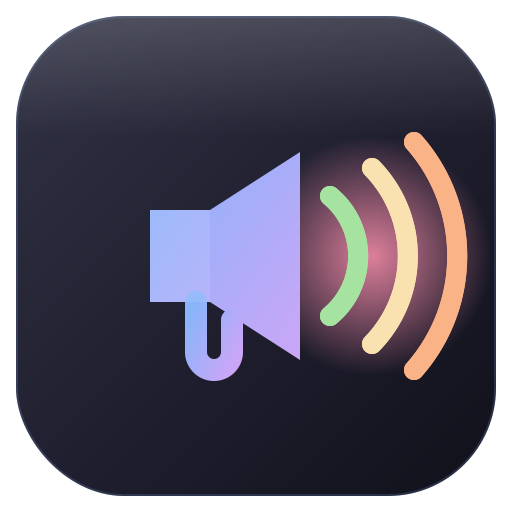

# Protect Soundboard — Promo Kit

Brand assets, social cards, ASCII art, and ready-to-post copy for promoting
[**protect-soundboard**](https://github.com/pueblokc/protect-soundboard).

---

## 🎨 Brand

| Token | Hex | Use |
|-------|-----|-----|
| Base | `#1e1e2e` | background |
| Crust | `#11111b` | deepest background / tiles |
| Blue | `#89b4fa` | primary accent (horn) |
| Mauve | `#cba6f7` | secondary accent (gradient end) |
| Green | `#a6e3a1` | "any audio" / OK |
| Yellow | `#f9e2af` | mid soundwave |
| Peach | `#fab387` | outer soundwave |
| Red | `#f38ba8` | siren |

Palette: **Catppuccin Mocha**. Fonts: **Inter** (display), **JetBrains Mono** (code/labels).
Icon motif: a megaphone in a blue→mauve gradient emitting green/yellow/peach soundwaves over a red siren glow.

## 🖼️ Images (in `assets/`)

| File | Size | Where it goes |
|------|------|---------------|
| `icon.svg` | vector | master app icon |
| `icon-16…512.png` | square | favicons / PWA / app icons |
| `favicon.ico` | 16/32/48 | browser tab |
| `apple-touch-icon.png` | 180 | iOS home-screen |
| `og-card.png` | 1200×630 (@2×) | Open Graph / Twitter / link unfurls |
| `github-social.png` | 1280×640 (@2×) | high-res social card |
| `github-social-1x.png` | 1280×640 | **upload as the repo's GitHub social preview** (<1 MB) |
| `hero-banner.png` | 1600×500 (@2×) | top of posts / blog / README |
| `phone-mock.png` | 1200×800 (@2×) | product shot for stores / posts |

## 📣 Posts (in `posts/`)

| File | Target |
|------|--------|
| `reddit-ubiquiti.md` | r/Ubiquiti (cross-post r/UNIFI) |
| `reddit-homeassistant.md` | r/homeassistant + HA community forum |
| `show-hn.md` | Hacker News (Show HN) |
| `ui-community.md` | community.ui.com |
| `blog-kccsonline.md` | kccsonline.com blog |

`ascii-art.txt` — banner variants for terminals, `--help`, MOTDs, and post bodies.

## ✅ Posting checklist / order of operations

1. **Set the GitHub social preview first** — repo → Settings → General → *Social preview* → upload
   `assets/github-social-1x.png`. (This can't be done via API, only the web UI.) Do this before sharing any
   link so unfurls look right everywhere.
2. **Soft-launch** in a Discord/forum or two (Ubiquiti unofficial Discord, HA Discord) for early feedback.
3. **r/Ubiquiti** + cross-post **r/UNIFI**. Best window: weekday mornings US time.
4. **r/homeassistant** + the HA community forum "Share your Projects!" thread.
5. **community.ui.com**.
6. **Show HN** — submit, then immediately post the prepared first comment.
7. **Blog post** on kccsonline.com (SEO + client credibility), link the repo.

### Framing rules (don't skip)
- Lead with the **talkback reverse-engineering** + the **how-to doc**. The app is the proof, not the pitch.
- Be upfront it's a **private/undocumented API, Protect 7.x**. Honesty preempts the "this'll break" pile-on
  and earns that community's trust.
- A short **demo GIF** (horn speaking a custom line) will outperform static images on Reddit/HN. Capture one
  if you can.

---

**© 2026 KCCS · [kccsonline.com](https://kccsonline.com)**

